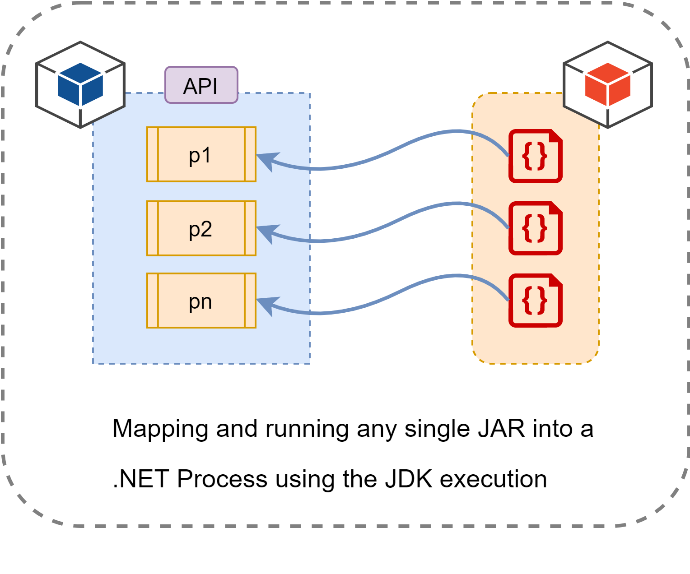

# SharpJDKWrapper

[](https://opensource.org/licenses/MIT)
[](https://github.com/engineering87/SharpJDKWrapper/issues)
[](https://github.com/engineering87/SharpJDKWrapper)

A simple project that enables the execution of Java applications within a .NET environment, ideal for scenarios requiring quick hosting and testing of Java services without the need for dedicated application servers.

### How it works
SharpJDKWrapper, built on .NET Framework 4.8, enables the execution of Java JAR files within .NET processes in a Windows environment. It can be installed as a Windows service, allowing JARs to be hosted for testing purposes without the need for configuring application servers like Tomcat.



### How to use it
To use SharpJDKWrapper, you need to configure the following keys within the application config:

```csharp
	<appSettings>
		<add key="JDK_DIRECTORY" value="C:\JDK\bin"/>
		<add key="JAR_DIRECTORY" value="C:\JARs"/>
		<add key="API_ADDRESS" value="http://localhost:12345/"/>
	</appSettings>
```

In the `JDK_DIRECTORY` key, specify the path to the directory where the JDK is installed. In `JAR_DIRECTORY`, provide the path to the directory containing the JAR files. 
Finally, `API_ADDRESS` defines the endpoint at which the APIs will be exposed.

### API
SharpJDKWrapper provides REST APIs to perform specific commands, including:

* Retrieving the number of active Java services.
* Checking the status of a particular Java service.
* Stopping a specific Java service.

### Future improvements
SharpJDKWrapper can be easily migrated to.NET Core.

## How to Contribute
Thank you for considering to help out with the source code!
If you'd like to contribute, please fork, fix, commit and send a pull request for the maintainers to review and merge into the main code base.

 * [Setting up Git](https://docs.github.com/en/get-started/getting-started-with-git/set-up-git)
 * [Fork the repository](https://docs.github.com/en/pull-requests/collaborating-with-pull-requests/working-with-forks/fork-a-repo)
 * [Open an issue](https://github.com/engineering87/SharpJDKWrapper/issues) if you encounter a bug or have a suggestion for improvements/features

### Licensee
SharpJDKWrapper source code is available under MIT License, see license in the source.

### Contact
Please contact at francesco.delre.87[at]gmail.com for any details.
